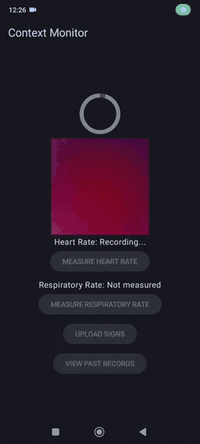
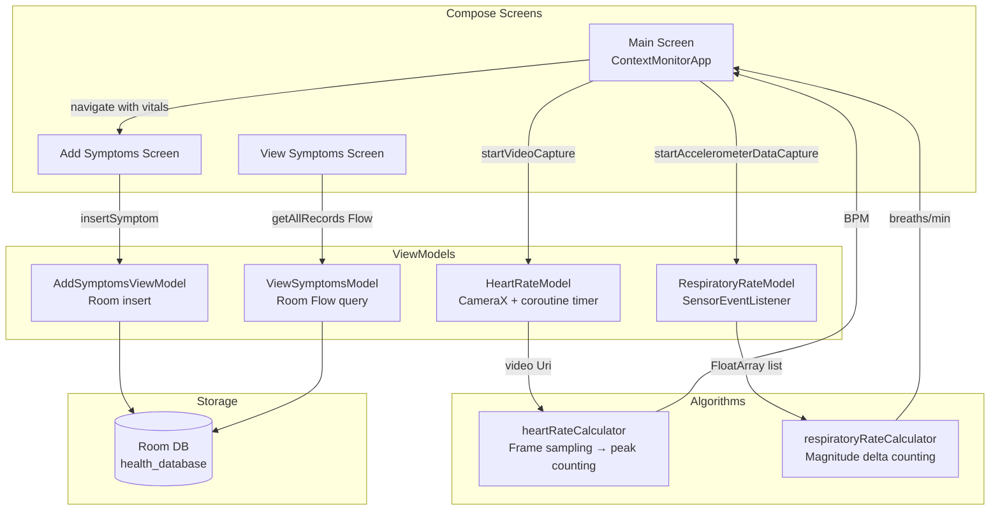

# Context Monitor

**Contactless vital sign tracking on any Android device — no wearable required.**

An Android app that measures heart rate via the rear camera and respiratory rate via the accelerometer, then lets users log associated symptoms with severity ratings and review a timestamped health history.

---

## Overview

Context Monitor turns a standard Android smartphone into a passive health monitoring tool. It uses two hardware sensors already present on every phone — the camera and the accelerometer — to estimate two key vital signs without any external device or internet connection. Readings are stored locally with a Room database and can be reviewed at any time.

**Target users:** individuals who want a lightweight, on-device health check-in tool, or developers studying sensor-based signal processing on Android.

---

## Preview / Demo

<p align="center">
  
</p>

The GIF shows the full core workflow: idle main screen → rear-camera heart rate recording (torch on, red preview) → "Calculating…" → HR: 120 BPM result → respiratory rate collection → symptom entry with star ratings.

Full demo videos:
- [Heart Rate & App Overview](https://www.youtube.com/watch?v=TU8mCt1sz3s)
- [Respiratory Rate & Symptom Logging](https://www.youtube.com/watch?v=jxaa_TT-dZI)

---

## Highlights

- **Camera-based heart rate estimation** — records a short video with the torch enabled, extracts frames via `MediaMetadataRetriever`, samples a central pixel region per frame, smooths the red-channel signal with a rolling window, and counts intensity peaks to derive BPM.
- **Accelerometer-based respiratory rate estimation** — registers the device accelerometer for 45 seconds, computes per-sample acceleration magnitude (`√(x²+y²+z²)`), counts direction reversals above a threshold, and converts to breaths per minute.
- **Orientation locking during capture** — screen rotation is locked for the full collection + calculation window to prevent sensor noise from postural changes.
- **Reactive MVVM architecture** — four `AndroidViewModel` subclasses manage lifecycle-safe sensor/camera sessions, coroutine-scoped timers, and Compose `StateFlow` / `mutableStateOf` observables.
- **Structured symptom log** — ten clinically relevant symptoms (Fever, Cough, Shortness of Breath, etc.) each rated 1–5 stars, stored with vitals in a local Room database and viewable in reverse-chronological order.
- **Zero network dependency** — all computation and storage happen on-device; no account, no cloud, no permissions beyond Camera.

---

## Features

### Vital Sign Measurement
- **Heart rate** — 45-second rear-camera video, torch on, frame-by-frame red-channel analysis → BPM
- **Respiratory rate** — 45-second accelerometer capture, magnitude-delta counting → breaths/min
- Circular progress indicator shows real-time collection progress for both measurements

### Symptom Logging
- 10 built-in symptoms: Nausea, Headache, Diarrhea, Sore Throat, Fever, Muscle Ache, Loss of Smell or Taste, Cough, Shortness of Breath, Feeling Tired
- Per-symptom 1–5 star severity picker
- Upload only enabled once both vitals are measured

### Health History
- Scrollable list of all past entries (most recent first)
- Each card shows date/time, heart rate, respiratory rate, and rated symptoms

---

## Tech Stack

| Layer | Technology | Purpose |
|---|---|---|
| Language | Kotlin 1.9 | Application code |
| UI | Jetpack Compose + Material3 | Declarative UI, navigation |
| Navigation | Navigation Compose 2.8 | 3-screen nav graph |
| Camera | CameraX 1.2.2 | Video capture + torch control |
| Sensors | Android `SensorManager` | Accelerometer data collection |
| Video decoding | `MediaMetadataRetriever` | Frame extraction from recorded video |
| Persistence | Room 2.6.1 | Local SQLite database |
| Serialization | Gson 2.10.1 | `Map<String, Int>` Room type converter |
| Architecture | MVVM / AndroidViewModel | Lifecycle-safe state management |
| Build | Gradle 8.6 + KSP | Room annotation processing |

---

## Architecture



---

## How It Works

1. **Heart rate capture** — User taps "MEASURE HEART RATE." CameraX binds to the rear camera, enables the torch, and starts an MP4 recording. A coroutine ticks a progress counter for 45 seconds then stops the recording.

2. **Heart rate calculation** — `heartRateCalculator` extracts every 15th frame (indices 10–425) from the saved video using `MediaMetadataRetriever`, samples a 100×100 center pixel region per frame to build a red-intensity time series, applies a 5-point rolling average to smooth noise, counts upward transitions exceeding a fixed threshold, and scales the count to BPM.

3. **Respiratory rate capture** — User taps "MEASURE RESPIRATORY RATE." `SensorManager` registers the accelerometer at `SENSOR_DELAY_NORMAL`. A coroutine ticks for 45 seconds, accumulating raw XYZ samples, then unregisters the listener.

4. **Respiratory rate calculation** — `respiratoryRateCalculator` computes the acceleration magnitude for each sample, counts consecutive samples where the magnitude changes by more than 0.15 m/s², and converts that count to breaths per minute.

5. **Symptom logging** — Once both vitals are measured, the "UPLOAD SIGNS" button activates. The user selects symptoms and rates severity; the data is inserted into Room as a `DataEntity` with a timestamp.

6. **History review** — "VIEW PAST RECORDS" navigates to a `LazyColumn` of all stored entries, loaded via a Room `Flow` and displayed as cards in reverse-chronological order.

---

## Setup

### Prerequisites
- Android Studio Hedgehog or later
- Android device or emulator running **Android 10+ (API 29+)**
- Rear camera required for heart rate measurement

### Clone & Open
```sh
git clone https://github.com/ak-asu/Context-Monitor.git
cd Context-Monitor
# Open in Android Studio: File > Open > select the project folder
```

### Build & Run
```sh
# From Android Studio: Run > Run 'app'
# Or via Gradle wrapper:
./gradlew assembleDebug
```

### Install on device
```sh
./gradlew installDebug
```

### Run tests
```sh
./gradlew test          # unit tests
./gradlew connectedAndroidTest  # instrumented tests
```

> **No environment variables or API keys are required.** All features run fully on-device.

---

## Usage

### Measure Heart Rate
1. Open the app. Tap **MEASURE HEART RATE**.
2. Grant camera permission if prompted.
3. Place your fingertip over the rear camera lens (covers the flash).
4. Hold still for 45 seconds while the progress ring fills.
5. Heart rate (BPM) appears below the preview once calculated.

### Measure Respiratory Rate
1. Tap **MEASURE RESPIRATORY RATE**.
2. Place the phone on your chest or hold it still on a flat surface.
3. Breathe normally for 45 seconds.
4. Respiratory rate (breaths/min) appears once the timer completes.

### Log Symptoms
1. After both readings are available, tap **UPLOAD SIGNS**.
2. Select a symptom from the dropdown; rate severity 1–5 stars.
3. Repeat for any additional symptoms.
4. Tap **UPLOAD SYMPTOMS** to save the full record.

### View History
- Tap **VIEW PAST RECORDS** from the main screen to browse all past entries.

---

## Key Decisions

| Decision | Rationale | Tradeoff |
|---|---|---|
| Camera-only heart rate (no ML model) | No model weights to ship; works offline on low-end devices | Lower accuracy than PPG with dedicated sensor or ML pipeline |
| Accelerometer for respiratory rate | Available on all Android devices; no extra hardware | Subject to motion artifacts if device moves during capture |
| Fixed 45-second window for both sensors | Enough data for a stable estimate; short enough to be practical | No adaptive window; noisy environments may skew results |
| Room + Gson type converters | Avoids separate table for symptoms; keeps schema flat | Map serialization is brittle if symptom keys change across versions |
| Orientation lock during capture | Prevents axis remapping and pixel shift that corrupt the signal | Minor UX friction; user cannot rotate screen mid-measurement |
| MVVM with AndroidViewModel | Camera and sensor resources need application context; must survive config changes | Slightly more boilerplate than a simpler architecture |

---

## Innovation / Notable Work

**Signal processing without a DSP library.** Both vital sign algorithms are implemented from scratch in pure Kotlin. The heart rate calculator builds a red-channel intensity time series from raw bitmaps, applies a sliding window average to suppress frame noise, and detects peaks via a fixed-delta threshold — a compact photoplethysmography (PPG) pipeline. The respiratory rate calculator uses the Euclidean norm of the 3-axis accelerometer vector to detect breathing-induced body movements, making it axis-agnostic and position-tolerant.

**Lifecycle-safe sensor sessions.** `RespiratoryRateModel` implements `SensorEventListener` directly and cleans up the sensor registration in `onCleared()`, preventing battery drain or ghost listeners across configuration changes. The camera session follows the same pattern via `ProcessCameraProvider.unbindAll()`.

**Compose state machine for measurement flow.** The main screen manages a multi-state UI (idle / collecting / calculating / ready) entirely through `rememberSaveable` + `mutableStateOf`, including correct state reset when returning from the Add Symptoms screen via `SavedStateHandle`.

---

## About

Context Monitor was built to explore contactless vital sign estimation using commodity Android hardware. The core problem — extracting physiologically meaningful signals from a camera and a MEMS accelerometer, with no server and no wearable — requires careful signal processing and precise lifecycle management. The project demonstrates end-to-end sensor data handling, MVVM architecture, and local persistence on Android.
